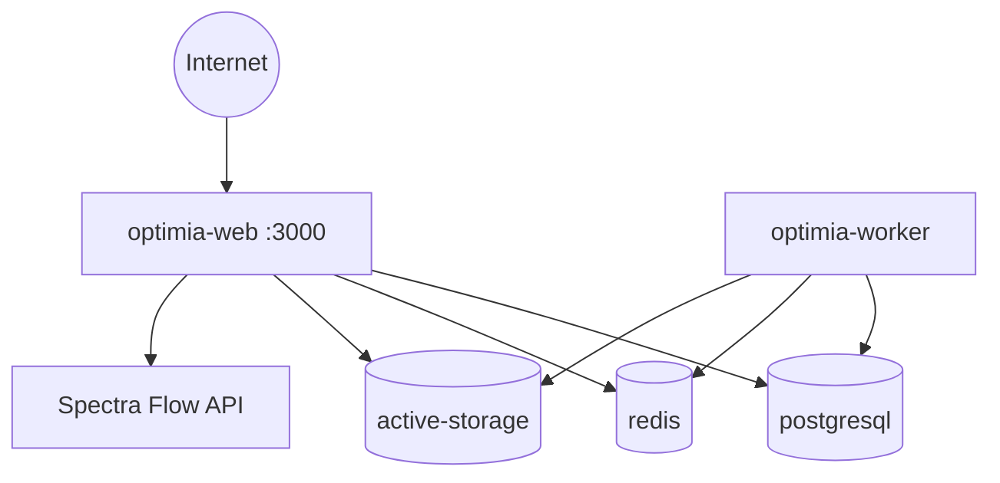

# Topología de despliegue — OptimiA

## Requisito fundamental

Una instalación productiva **completa** de Chatwoot/OptimiA requiere **cinco componentes**:

```
optimia-web        → Servidor HTTP (Rails)
optimia-worker     → Procesador de jobs (Sidekiq)
postgresql         → Base de datos persistente
redis              → Colas, cache, ActionCable
active-storage     → Archivos adjuntos (local o object storage)
```

Desplegar solo `optimia-web` produce una instalación **incompleta e inestable**.

---

## optimia-web

| Atributo | Valor |
|----------|-------|
| **Responsabilidad** | Servir dashboard, API REST, ActionCable, widget |
| **Comando** | `bundle exec rails server -b 0.0.0.0 -p 3000` |
| **Puerto** | 3000 |
| **Dependencias** | PostgreSQL (ready), Redis (ready) |
| **Persistencia** | Stateless; assets precompilados en imagen |
| **Healthcheck** | `GET /health` → HTTP 200, body `{"status":"woot"}` |
| **Restart** | `always` / `unless-stopped` |

### Riesgo si no está presente

Aplicación completamente inaccesible. Sin UI, sin API, sin widget.

### Healthcheck recomendado (EasyPanel / Docker)

```yaml
healthcheck:
  test: ["CMD", "curl", "-f", "http://localhost:3000/health"]
  interval: 30s
  timeout: 10s
  retries: 3
  start_period: 60s
```

---

## optimia-worker

| Atributo | Valor |
|----------|-------|
| **Responsabilidad** | Jobs asíncronos: emails, webhooks, WhatsApp, notificaciones, Spectra downloads |
| **Comando** | `bundle exec sidekiq -C config/sidekiq.yml` |
| **Puerto** | Ninguno expuesto |
| **Dependencias** | PostgreSQL, Redis (mismas credenciales que web) |
| **Persistencia** | Stateless |
| **Healthcheck** | Verificar proceso Sidekiq activo o queue latency < umbral |
| **Restart** | `always` |

### Riesgo si no está presente

| Funcionalidad afectada | Impacto |
|------------------------|---------|
| Envío de emails | Mensajes no salen |
| Webhooks salientes | Integraciones externas fallan |
| WhatsApp async | Mensajes quedan en cola |
| Notificaciones push | No se entregan |
| Jobs Spectra | Descargas diferidas fallan |
| Auto-asignación | No procesa |

### Healthcheck recomendado

```bash
# Verificar proceso
pgrep -f sidekiq || exit 1
```

O monitorizar `sidekiq_queue_latency` vía Redis/Sidekiq API.

---

## postgresql

| Atributo | Valor |
|----------|-------|
| **Responsabilidad** | Datos de aplicación: cuentas, conversaciones, contactos, configuración |
| **Imagen recomendada** | `pgvector/pgvector:pg16` |
| **Puerto** | 5432 (interno) |
| **Dependencias** | Ninguna |
| **Persistencia** | **Crítica** — volumen en `/var/lib/postgresql/data` |
| **Healthcheck** | `pg_isready -U $POSTGRES_USERNAME -h localhost` |
| **Variables** | `POSTGRES_HOST`, `POSTGRES_USERNAME`, `POSTGRES_PASSWORD`, `POSTGRES_DATABASE` |

### Riesgo si no está presente o sin volumen

Pérdida total de datos al reiniciar contenedor. Aplicación no arranca.

### Backup

Dump diario (`pg_dump`) + retención mínima 30 días. Ver [`backup-runbook.md`](../operations/backup-runbook.md).

---

## redis

| Atributo | Valor |
|----------|-------|
| **Responsabilidad** | Colas Sidekiq, cache, ActionCable pub/sub, rate limiting |
| **Imagen recomendada** | `redis:alpine` |
| **Puerto** | 6379 (interno) |
| **Autenticación** | `requirepass` obligatorio en producción |
| **Persistencia** | Volumen recomendado para RDB/AOF |
| **Healthcheck** | `redis-cli -a $REDIS_PASSWORD ping` |
| **Variables** | `REDIS_URL`, `REDIS_PASSWORD` |

### Uso por componente

| Componente | Uso Redis |
|------------|-----------|
| Sidekiq | Colas de jobs |
| ActionCable | Pub/sub websockets |
| Rack::Attack | Rate limit counters |
| Cache | Fragment/query cache |

### Riesgo si no está presente

Web arranca pero jobs no procesan; websockets fallan; sesiones en cache se pierden.

---

## active-storage

| Atributo | Valor |
|----------|-------|
| **Responsabilidad** | Archivos adjuntos, avatares, medios WhatsApp |
| **Modo local** | Volumen `/app/storage` |
| **Modo recomendado** | S3 o Cloudflare R2 (`ACTIVE_STORAGE_SERVICE=s3_compatible`) |
| **Variables** | `ACTIVE_STORAGE_SERVICE`, `S3_BUCKET_NAME`, `AWS_ACCESS_KEY_ID`, `AWS_SECRET_ACCESS_KEY`, `AWS_REGION` |
| **Backup** | Versioning del bucket o sync periódico |

### Riesgo si no está presente o sin persistencia

Archivos adjuntos se pierden en redeploy. Medios de conversaciones inaccesibles.

---

## Proceso de migraciones (release job)

Las migraciones **no deben ejecutarse** en el CMD del contenedor web en cada restart.

Patrón recomendado (equivalente al `Procfile` release):

```bash
POSTGRES_STATEMENT_TIMEOUT=600s bundle exec rails db:chatwoot_prepare
```

Ejecutar como **job de release** una sola vez antes de desplegar la nueva versión web/worker.

---

## Diagrama de dependencias



---

## Estado actual vs objetivo

| Aspecto | Actual (Dockerfile raíz) | Objetivo |
|---------|--------------------------|----------|
| Servicios | Solo web en un contenedor | Web + worker separados |
| Sidekiq | Ausente | Servicio dedicado |
| Migraciones | No automatizadas | Release job |
| Healthcheck | No definido | `/health` en web |
| Usuario | root | non-root |
| Storage | No documentado | S3/R2 recomendado |
