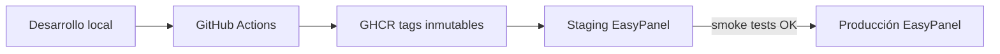

# Estado objetivo — OptimiA

> Arquitectura target. **No implementada** en Sprint 0.

## Repositorio canónico

```
DSW-Factory/optimia-chatwoot
```

Migración desde `pablo-paez-dev/chatwoot` preservando historial completo. Ver [ADR-001](../adr/ADR-001-canonical-repository.md).

## Estrategia de ramas

| Rama | Propósito | Protección |
|------|-----------|------------|
| `main` | Producción estable | Protected, require PR + review |
| `develop` | Integración continua | Protected |
| `release/*` | Preparación de releases OptimiA | Temporal |
| `upgrade/*` | Rebases/merges de Chatwoot upstream | Temporal |
| `hotfix/*` | Correcciones urgentes en prod | Merge a `main` + backport a `develop` |

## Remotes

```
origin    → DSW-Factory/optimia-chatwoot
upstream  → chatwoot/chatwoot
```

## Registro de imágenes

```
ghcr.io/dsw-factory/optimia-chatwoot:cw-4.10.1-optimia-0.1.2
```

- Tags **inmutables** por release.
- Prohibido `:latest` en producción.
- Misma imagen promovida staging → producción (sin rebuild).

## Entornos



### Staging

- Topología idéntica a producción.
- Base de datos y Redis aislados.
- Dominio separado (ej. `staging.optimia.spectra-metrics.com`).
- Variables ENV propias (sin compartir secretos con prod).

### Producción

- Servicios: web, worker, PostgreSQL, Redis, storage.
- Dominio: `https://app.optimia.spectra-metrics.com`
- Backups automatizados con prueba de restauración mensual.

## Servicios de runtime

| Servicio | Imagen | Comando |
|----------|--------|---------|
| `optimia-web` | `ghcr.io/dsw-factory/optimia-chatwoot:<tag>` | `bundle exec rails server -b 0.0.0.0 -p 3000` |
| `optimia-worker` | Misma imagen, tag idéntico | `bundle exec sidekiq -C config/sidekiq.yml` |
| `postgresql` | `pgvector/pgvector:pg16` | Managed/volumen persistente |
| `redis` | `redis:alpine` | Con `requirepass` |
| `active-storage` | S3/R2 recomendado | Bucket con versioning |

## CI/CD objetivo

```
commit → lint + test → build imagen → push GHCR (tag inmutable)
  → deploy staging (mismo tag) → smoke tests
  → promoción manual del mismo tag → producción
  → validación post-deploy
```

- **No** reconstruir imagen distinta por entorno.
- Migraciones como **release job** separado, antes del deploy web.
- Rollback = re-deploy del tag anterior.

## Almacenamiento

| Opción | Recomendación |
|--------|---------------|
| Active Storage local | Solo desarrollo/staging temporal |
| S3 / Cloudflare R2 | **Recomendado para producción** |
| Backup storage | Versioning + lifecycle policy |

## Observabilidad

- Sentry (frontend + backend) vía `SENTRY_DSN` / `SENTRY_FRONTEND_DSN`
- Logs JSON a stdout (`RAILS_LOG_TO_STDOUT=true`)
- Uptime check en `GET /health`
- Alertas Sidekiq queue depth

## Módulos propios (desacoplados)

```
lib/integrations/
├── spectra_flow/     # Activo
└── evolution/        # Activo (Sprint 2 — Connection Center)
```

Branding vía ENV + `installation_config` + assets, no strings hardcodeadas en `en.yml` completo.

## Documentación operativa

- Runbooks en `docs/optimia/operations/`
- ADRs en `docs/optimia/adr/`
- Inventario actualizado por sprint

## Criterios de éxito

- [ ] Repo canónico en DSW-Factory operativo
- [ ] CI publica en `ghcr.io/dsw-factory/optimia-chatwoot`
- [ ] Staging desplegado con web + worker
- [ ] Trazabilidad repo → imagen → EasyPanel verificada
- [ ] Backups con restore probado
- [ ] Sin `:latest` en producción
