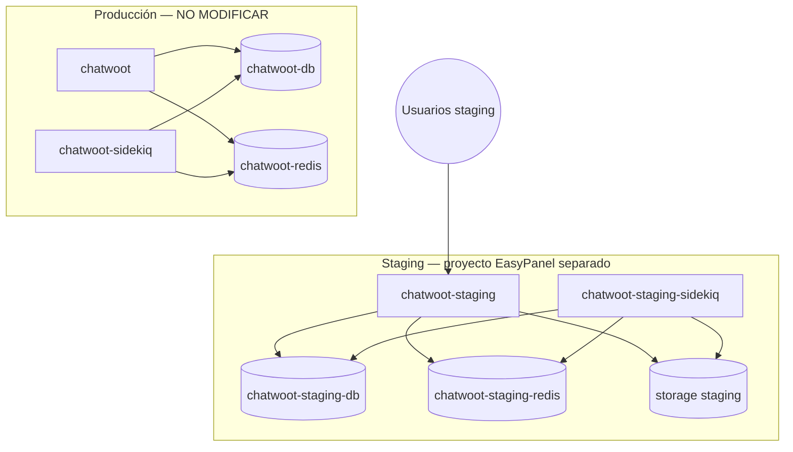

# Arquitectura de staging — OptimiA

> Entorno **completamente aislado** de producción. Documento de diseño — **sin despliegue** en Sprint 1.

## Principio

Staging replica la **topología** de producción, no sus **datos** ni **credenciales**.

```
PRODUCCIÓN (no tocar)              STAGING (nuevo proyecto EasyPanel)
─────────────────────              ─────────────────────────────────
chatwoot                    ≠      chatwoot-staging
chatwoot-sidekiq            ≠      chatwoot-staging-sidekiq
chatwoot-db                 ≠      chatwoot-staging-db
chatwoot-redis              ≠      chatwoot-staging-redis
```

## Diagrama



## Servicios staging (4 + storage)

| Servicio EasyPanel | Rol | Imagen / origen |
|--------------------|-----|-----------------|
| `chatwoot-staging` | Web (Rails) | `ghcr.io/disruptive-dev/chatwoot:staging-cw-4.10.1-optimia-0.1.2` *(o tag acordado)* |
| `chatwoot-staging-sidekiq` | Worker (Sidekiq) | **Misma imagen y tag que web** |
| `chatwoot-staging-db` | PostgreSQL | `pgvector/pgvector:pg16` (recomendado, igual que prod) |
| `chatwoot-staging-redis` | Redis | `redis:alpine` |
| Volumen storage | Active Storage local | `/app/storage` en web y worker |

## Dominio staging (propuesto)

| Uso | URL propuesta |
|-----|---------------|
| `FRONTEND_URL` | `https://staging.optimia.spectra-metrics.com` |
| Acceso humano | Mismo dominio vía EasyPanel proxy |

> Confirmar dominio y DNS **antes** del primer deploy. No reutilizar `app.optimia.spectra-metrics.com`.

## Comparación prod vs staging

| Aspecto | Producción (verificado) | Staging (diseño) |
|---------|-------------------------|------------------|
| Proyecto EasyPanel | Existente (prod) | **Nuevo proyecto** |
| Imagen web/worker | `v4.10.1-optimia.6` | Tag `staging-*` distinto |
| PostgreSQL | `chatwoot-db` | `chatwoot-staging-db` — **vacío** |
| Redis | `chatwoot-redis` | `chatwoot-staging-redis` — **vacío** |
| `SECRET_KEY_BASE` | Prod (no copiar) | **Nuevo** generado |
| Datos clientes | Reales | **Ninguno** — seed manual mínimo |
| Canales WA/FB/IG | Reales | **No conectar** |
| Webhooks salientes | Reales | Deshabilitados o URL staging |
| Spectra Flow | Prod (si aplica) | Endpoint/token **staging** separado |
| SMTP | Prod | Mailhog, sandbox o deshabilitado |

## Red y aislamiento

- Proyecto EasyPanel **separado** (no añadir servicios al proyecto prod).
- Hostnames internos distintos (`chatwoot-staging-db`, no `chatwoot-db`).
- Sin volúmenes compartidos entre proyectos.
- Sin variables ENV copiadas de prod (generar nuevas).

## Secuencia de creación (orden)

1. Crear **proyecto** EasyPanel staging.
2. Crear `chatwoot-staging-db` + volumen.
3. Crear `chatwoot-staging-redis` + password nuevo.
4. Crear `chatwoot-staging` (web) — **sin iniciar** hasta ENV completo.
5. Crear `chatwoot-staging-sidekiq` — misma imagen/tag.
6. Ejecutar **release job** migraciones (una vez, sobre BD staging vacía).
7. Iniciar web → worker.
8. Smoke tests (ver guía EasyPanel).

## Qué NO incluye staging

- Copia de BD producción.
- Copia de archivos `/app/storage` producción.
- Mismas API keys de WhatsApp, Facebook, Instagram, Evolution.
- Mismo bucket S3/R2 que producción (si prod usa cloud storage).
- Mismo `SECRET_KEY_BASE` ni passwords de prod.

## Referencias

- Topología general: [`../architecture/deployment-topology.md`](../architecture/deployment-topology.md)
- Guía manual: [`../operations/easypanel-staging-setup-guide.md`](../operations/easypanel-staging-setup-guide.md)
- Controles: [`staging-isolation-controls.md`](staging-isolation-controls.md)
