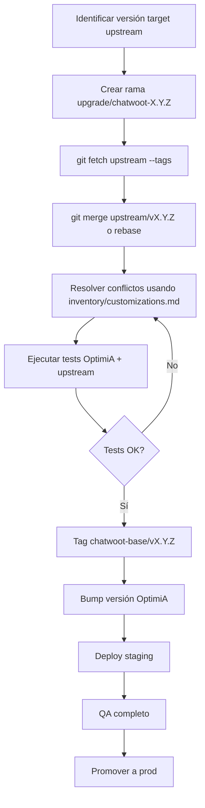

# Estrategia upstream — OptimiA

## Remotes configurados (Sprint 0)

```
origin    https://github.com/pablo-paez-dev/chatwoot
upstream  https://github.com/chatwoot/chatwoot.git
```

## Estado de sincronización

| Métrica | Valor (2026-07-23) |
|---------|-------------------|
| Rama comparada | `develop` vs `upstream/develop` |
| Commits adelante (OptimiA) | 43 |
| Commits detrás (upstream) | 713 |
| Merge-base | `6a7cbcf5` |
| Tag baseline | `chatwoot-base/v4.10.1` → `6a7cbcf5` |

## Flujo de actualización recomendado



## Estrategia de merge

### Opción A: Merge (recomendada para equipos pequeños)

```bash
git checkout -b upgrade/chatwoot-4.12.1 develop
git fetch upstream --tags
git merge v4.12.1
# resolver conflictos
```

**Ventaja:** Preserva historial completo.  
**Desventaja:** Commits upstream mezclados en historial.

### Opción B: Rebase (para historial limpio)

```bash
git checkout -b upgrade/chatwoot-4.12.1 chatwoot-base/v4.10.1
git cherry-pick <commits-optimia>
git rebase v4.12.1
```

**Ventaja:** Historial lineal.  
**Desventaja:** Más complejo con 43 commits.

## Archivos de alto riesgo en merge

Priorizar resolución manual en:

1. `ReplyBox.vue`
2. `config/locales/en.yml` / `es.yml`
3. `App.vue`
4. `config/routes.rb`
5. `vueapp.html.erb`
6. `Gemfile` / `Gemfile.lock`
7. `package.json` / `pnpm-lock.yaml`

## Reglas durante upgrade

- **No** modificar migraciones existentes.
- **No** eliminar módulo Spectra sin plan de migración.
- **Sí** ejecutar `db:chatwoot_prepare` en staging antes de prod.
- **Sí** mantener tests Spectra passing.
- **Sí** documentar conflictos resueltos en CHANGELOG.

## Frecuencia recomendada

| Tipo | Frecuencia |
|------|------------|
| Security patches upstream | Inmediato (hotfix) |
| Minor releases Chatwoot | Trimestral |
| Major releases Chatwoot | Semestral, con sprint dedicado |

## Rama existente de referencia

`origin/fix/optimia-whitelabel-v4-12-1` — intento previo de upgrade a 4.12.1 con branding pero **sin** módulo Spectra. No usar como base; revisar solo para lecciones aprendidas.

## Pre-requisitos antes de cualquier upgrade

- [ ] Sprint 0 completado (baseline, docs, inventario)
- [ ] Docker v2 implementado
- [ ] Staging operativo
- [ ] Backup prod verificado
- [ ] Tests Spectra en CI
